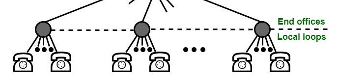
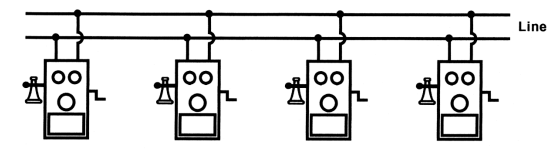
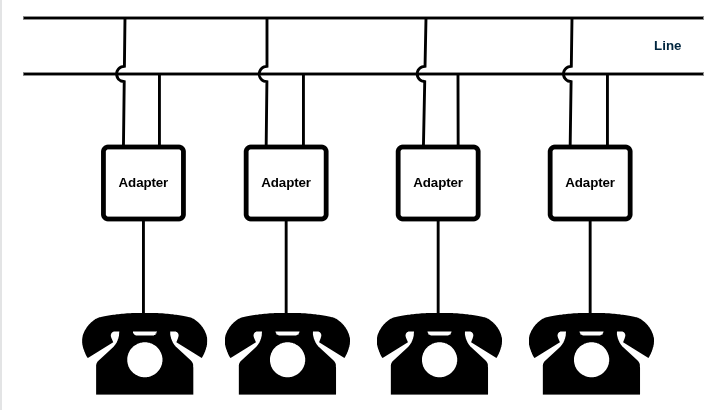

# RuralPhone
This project documents the construction of an adapter to convert a standard telephone to a rural "bridged" telephone.

## Why?
It can be used for:
* Small camp-outs between friends
* Adhoc disaster/emergency communication links
* Other outdoor events needing simple reliable communication (e.g. festivals, etc.)
* Amateur Radio field day setups
* Telephone collectors
* Fun with telephones for young and old

## Background
Common telephones (circa 1950's to 2000's) that can still be found today need a direct connection to a telephone office to work. 
This connection to a central office used what is called a Common Battery (CB).

This project creates a hardware adapter that connects these telephones together in a simple way that is portable and does not require a central office or changes to the telephone.
Early telephones (cica 1900's) contained what was called a Local Battery (LB) and a hand cranked generator (used for ringing) [^1].
These early telephones where used in rural areas and were all connected to one line with many telephones on a party line.

The party line system makes it easy since you just need one set of wires strung between all the locations.

This adapter converts the telephone from CB to LB and provides a way to "ring" the other telephones without a high voltage.

Other advantages of a LB telephone are that they can use just about any kind of wire for the connection (e.g. copper, steel, barbed wire, aluminum, etc.).
It is even possible to use a single wire with earth return [^2].
The adapter is needed for each phone on the wire. 
The adapter can be used with most any CB telephone.

## Basic Features
* Raspberry Pi Pico MCU
* MMBasic as the development environment
* Optional internal battery for field use

### Functions
* Set a station number
* Dial another station by number
* Ring just the telephone dialed

### Future Functions
* Ping another station to see if it is connected
* Line in use detection
* Determine last station that called
* Etc.

#### References

[^1]: Page 64, Old-Time Telephones (Ralph O. Meyer), https://repository.lib.ncsu.edu/bitstreams/f2b7ec52-1d8a-4e4a-8e35-b7af1cdf8d62/download
[^2]: Old Forest Telphone System, https://www.bedore.org/PhoneHistory.html
